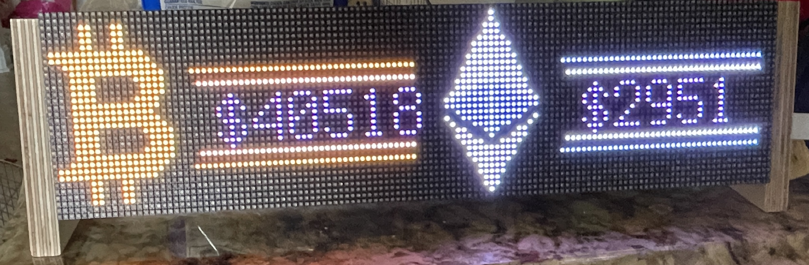

Crypto Ticker based on Adafruit Matrix Portal M4 using Circuit Python.  No soldering needed, just plug together, load code and edit secrets.py with your wifi credentials.

Crypto prices retrieved from coingecko.com; easy to change code to other cryptos.

Code setup for P2.5 RGB LED Matrix HUB75 panels.  If using larger panels, change color_order to "RGB".
